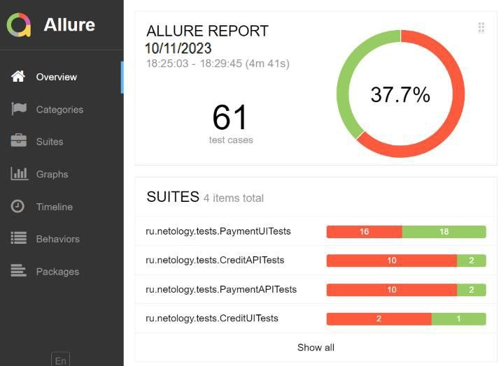
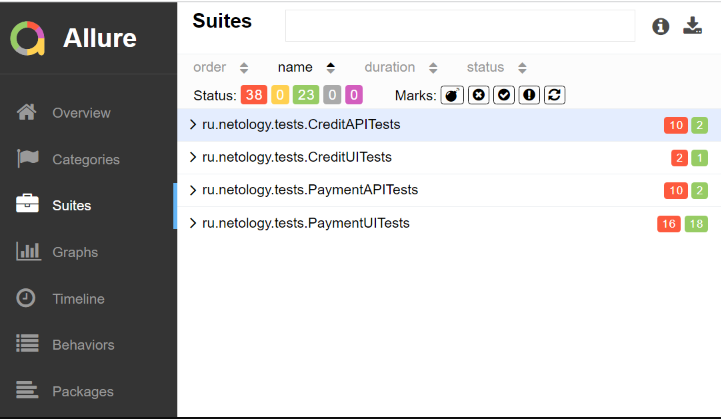
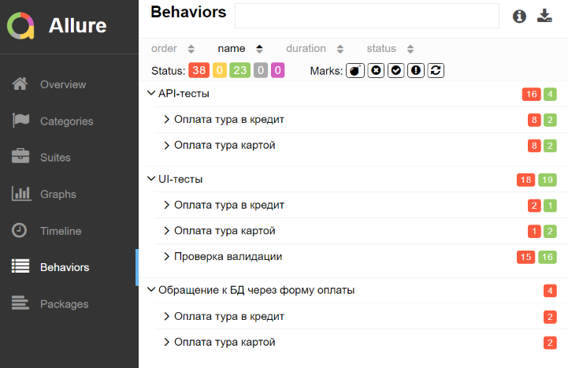

## Отчёт по итогам тестирования ##

### Краткое описание ###

Произведено тестирование комплексного сервиса, взаимодействующего с СУБД и API Банка.

Тестирование проводилось отдельно для двух заявленных СУБД:

- MySQL;
- PostgreSQL.

Результаты тестирования для обеих СУБД совпадают.

### Количество тест-кейсов ###

Всего в тестировании проведено 61 теста, 23 из которых успешны (37,7% в процентном соотношении).

#### Тесты по функционалу: ####

По результатам тестирования были заведены [баг-репорты](https://github.com/Evstafa/Diplom-QA-A/issues)

### Общие рекомендации ###

1. Исправить выявленные дефекты.
2. Составить полную документацию по проекту с указанием конкретного функционала и поведения элементов.
3. Для testability проекта рекомендуется добавить атрибут test-id элементам страниц.